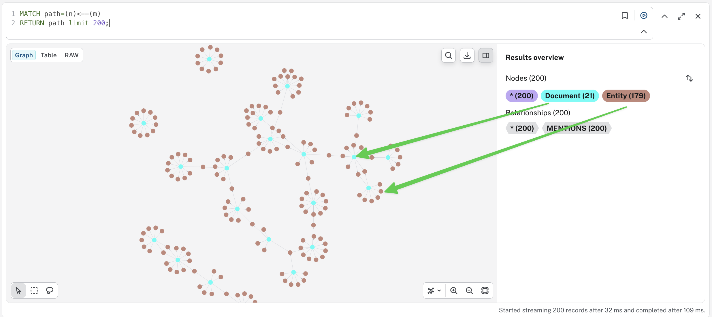
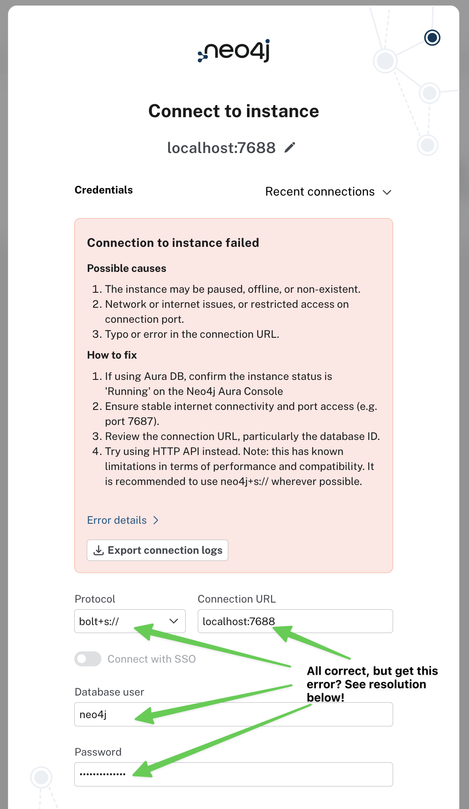

# This Repo supports the Neo4j Blog Post "Building a Highly Secure GraphRAG Platform with Confidential Computing"

Building the platform from the start and running the provided demo scripts.

## Prerequisites 
- **Neo4j 202x.x Enterprise Edition** (for security features) - Best way is, to run it as a container. Use the docker compose file provided in the repo, to spin up all necessary components like Neo4j Enterprise and the following ones.
- Access to **Edgeless Private Mode API (free for personal use here)** - The Private Mode Proxy is also installed as a container using the docker compose file in the Github repo. 
**IMPORTANT:** Get yourself an **API Key for the Confidential AI API** from the [Edgeless.system website here](https://www.privatemode.ai/#app_and_api). This key is **required** for the demo setup to work.
- **Neo4j MCP Server** - The third container needed, but easy to run is the MCP Cypher Server and that is also spun up using the docker compose file from the repo.
- **Python 3.10+ and uv** installed to run the demo scripts you can also find in the Github Repo. Python and uv (uv is optional) need to be installed on your system by yourself.


## Step 1: Clone the repo from Github

First, let's clone the repository from Github:
```bash
# git clone https://github.com/neo4j-field/neo4j-edgeless-graphrag.git
```

## Step 2: Install the project dependencies

We will use some libraries not part of the standard python installation. Either use pip and the requirements.txt file to install them **OR** install and use uv (recommended, see [here](https://docs.astral.sh/uv/getting-started/installation/) for instructions) for that. Then run the following:
```bash
# cp pyproject.toml.example pyproject.toml
# uv sync
```
That will create a virtual environment and you are all set to move on. Python scripts can then be run with:
```bash
# uv run python your-python-script.py
```

OR using pip:
```bash
# pip install -r requirements.txt
```

## Step 3: Create the necessary directory structure and self-signed certificates 

```bash
# ./1_build_dir_structure_certs.sh
```

This will create a directory structure for Neo4j, the Private Mode Proxy and the Neo4j MCP Server. Then it creates self-signed certificates (if you have your own, go ahead and use them) and copies them into the different certificate directories. Finally it will adjust permission on them to make sure, they can be accessed by the containers. 

If that was successfully done, you can spin up the complete backend.

## Step 4: Spin up the complete backend using docker compose

First make sure, you copied the environment file to its real name like this:
```bash
# cp dot_env.example .env
```

Then edit the ```.env``` file and set your Neo4j Passwort e.g. "neo4j&edgless". And also add your private mode API key, so the scripts later on can make use of the **private mode proxy**:

```bash
# -- Required Secrets (no defaults - must be set) --
NEO4J_ADMIN_PASSWORD=your-secure-password-here
PRIVATEMODE_API_KEY=your-privatemode-api-key-here
```
All other parameters can stay with their default. DO NOT CHANGE THEM unless you know what you do! 

The docker compose file included in the repository will help you, to spin up all necessary components:
```bash
# docker compose up -d
```

This will take a while, but once it ran successfully, you should see the following output from the command ```docker ps```:

```bash
# docker ps
CONTAINER ID   IMAGE                                                      COMMAND                  CREATED      STATUS                PORTS                                                                                      NAMES

f63a7dcd0026   mcp/neo4j:latest                                           "/app/neo4j-mcp"         3 days ago   Up 3 days             0.0.0.0:443->443/tcp, [::]:443->443/tcp                                                    neo4j-mcp

22f4a7abdd47   ghcr.io/edgelesssys/privatemode/privatemode-proxy:latest   "/bin/privatemode-pr…"   3 days ago   Up 3 days             0.0.0.0:8089->8080/tcp, [::]:8089->8080/tcp                                                privatemode-proxy

366f07877bfb   neo4j:enterprise                                           "tini -g -- /startup…"   3 days ago   Up 3 days (healthy)   0.0.0.0:7473->7473/tcp, [::]:7473->7473/tcp, 0.0.0.0:7688->7687/tcp, [::]:7688->7687/tcp   neo4j-graphrag
```

Three running containers called ```neo4j-mcp```, ```privatemode-proxy``` and ```neo4j-graphra``` should now run in your environment. This is all we need to build the Knowledge Graph and test our secure backend.

## Step 5: Create the Knowledge Graph Schema with RBAC

Before opening Neo4j Browser just a quick note, that may save you time. If you get an error message connecting with Neo4j Browser to your database, this is due to the self-signed certificates. That is easy to fix doing the following:  
1. First point your browser at [https://localhost:7688](https://localhost:7688) and accept the certificate (e.g. by clicking “visit this website” or accepting the certificate)  
2. Now you can move on es explained blow. The trick here is, to accept the self-signed certificate for https and the bolt+s protocol. See the Github report for some more details

Open your browser and point it to ```https://localhost:7473```. Neo4j Browser should be coming running now and you can log into your Neo4j Enterprise Database. Use your Password set in the ```.env``` file to log into your database. 
**Also make sure**, you use the right Neo4j Protocol and Port. It needs to be ```bolt+s://``` with ```localhost:7688```. 


Then run the following commands by copy and paste them into the the Neo4j Browser. They can also be found in the repo as file named ```2_create_constraints.cypher```:

```cypher
// === Schema Setup ===

// Create constraints for our document graph
CREATE CONSTRAINT document_id IF NOT EXISTS
FOR (d:Document) REQUIRE d.id IS UNIQUE;

CREATE CONSTRAINT entity_id IF NOT EXISTS  
FOR (e:Entity) REQUIRE e.id IS UNIQUE;

// Create vector index for semantic search
CREATE VECTOR INDEX document_embeddings IF NOT EXISTS
FOR (d:Document)
ON d.embedding
OPTIONS {indexConfig: {
  `vector.dimensions`: 2560,
  `vector.similarity_function`: 'cosine'
}};

// Create Entity constraints and vector index (idempotent)
CREATE CONSTRAINT entity_name_unique IF NOT EXISTS
FOR (e:Entity) REQUIRE e.name IS UNIQUE;

CREATE VECTOR INDEX entity_embeddings IF NOT EXISTS
FOR (e:Entity) ON (e.embedding)
OPTIONS {indexConfig: {
    `vector.dimensions`: 2560,
    `vector.similarity_function`: 'cosine'
 }};
```

Now also set up RBAC roles and permissions. This is where Neo4j's security model shines—you define roles once, and the database enforces access automatically. The commands can also be found in the script called ```3_create_roles_users.cypher```:

```cypher
// === RBAC Configuration (run as admin) ===

// Create roles for different access levels
CREATE ROLE finance_reader IF NOT EXISTS;
CREATE ROLE hr_reader IF NOT EXISTS;
CREATE ROLE executive_reader IF NOT EXISTS;
CREATE ROLE analyst IF NOT EXISTS;

// Grant base access to the neo4j database
GRANT ACCESS ON DATABASE neo4j TO finance_reader;
GRANT ACCESS ON DATABASE neo4j TO hr_reader;
GRANT ACCESS ON DATABASE neo4j TO executive_reader;
GRANT ACCESS ON DATABASE neo4j TO analyst;

// Finance role: can read finance-labeled neo4j
GRANT MATCH {*} ON GRAPH neo4j 
  FOR (document:Document) 
  WHERE document.department = 'finance'
  TO finance_reader;

// HR role: can read HR-labeled neo4j  
GRANT MATCH {*} ON GRAPH neo4j
  FOR  (document:Document)
  WHERE document.department = 'hr'
  TO hr_reader;

// Executive role: can read all neo4j marked for executive access
GRANT MATCH {*} ON GRAPH neo4j
  FOR  (document:Document)
  WHERE document.executiveAccess = true
  TO executive_reader;

// Analyst role: can read all public and internal neo4j
GRANT MATCH {*} ON GRAPH neo4j
  FOR  (document:Document)
  WHERE document.classification IN ['public', 'internal']
  TO analyst;

// All roles can traverse to entities (for context)
GRANT MATCH {*} ON GRAPH neo4j NODES Entity TO finance_reader;
GRANT MATCH {*} ON GRAPH neo4j NODES Entity TO hr_reader;
GRANT MATCH {*} ON GRAPH neo4j NODES Entity TO executive_reader;
GRANT MATCH {*} ON GRAPH neo4j NODES Entity TO analyst;

// Grant relationship traversal
GRANT MATCH {*} ON GRAPH neo4j RELATIONSHIPS * TO finance_reader;
GRANT MATCH {*} ON GRAPH neo4j RELATIONSHIPS * TO hr_reader;
GRANT MATCH {*} ON GRAPH neo4j RELATIONSHIPS * TO executive_reader;
GRANT MATCH {*} ON GRAPH neo4j RELATIONSHIPS * TO analyst;

// === Create Users and Assign Roles ===
CREATE USER alice SET PASSWORD 'secure-p@ssword-One' CHANGE NOT REQUIRED;
CREATE USER bob SET PASSWORD 'secure-p@ssword-Two' CHANGE NOT REQUIRED;

GRANT ROLE finance_reader TO alice;
GRANT ROLE analyst TO alice;

GRANT ROLE hr_reader TO bob;
GRANT ROLE analyst TO bob;
```

With this setup, when Alice queries the database, she'll automatically see finance documents and public/internal documents—but not HR documents. Bob sees the opposite. No additional application code needed to enforce this and no way around it from the application point of view.

## Step 6: Set Up the Confidential Embedding Pipeline and create your Knowledge Graph

Now the critical piece—generating embeddings within the confidential computing environment. Note that all connections use HTTPS/TLS encryption:

```bash
# uv run 4_secure_embedding_pipeline.py
```

The script ```4_secure_embedding_pipeline.py``` will now do the following. It loads all 50 documents from the file ```documents.json``` along with its meta data like the document_id, access rights, etc. and store it in the database.
In addition it will make use of the ***private mode proxy*** to create vector embeddings of the text and store it along with the nodes of the Knowledge Graph. Keep in mind that no data from your docs is leaking to the model, since we use **Confidential Compute**!

Next run the script ```5_extract_entities.py``` :

```bash
# uv run 5_extract_entities.py
```

This will extract the main entities from your documents and create Relationships between the entities and Nodes in the Graph, where the document text contains those entities.

If you have a look at the Neo4j Browser you should see your (:Document)<-[:MENTIONS]-(:Entity) structure by running the following command:

```cypher
MATCH path=MATCH(n)<--(m)
RETURN path LIMIT 200;
```
You you see the following:



**Note:** For the purpose of this demo this will be ok. In a real project, we would suggest to use a domain Ontology or Taxonomy in order to extract entities from the text. That would make the data model much more explicit. At the end of this blog post you will find some resources linked, to learn more about GraphRAG and Confidential Compute.

At this point we have created our Knowledge Graph and required vector embeddings using our **private mode proxy**. That is now our basis to start running some GraphRAG queries. 

## Step 7: Run a Secure GraphRAG Query with RBAC enforcing

Now let's create a query function that combines vector search with role-based security filtering. We'll use Neo4j's native RBAC by connecting with user-specific credentials using another script:
```bash
# uv run 6_graphrag_query.py -u alice -q "What is our revenue forecast?"
```

This again routes through the **private mode proxy**, but now leverages two models: the **embeddings model** to generate vector embeddings for **semantic search**, and the **conversational model** to construct the final answer—both accessed securely via the proxy.

Run the script again using user **Bob** instead of **Alice** and see RBAC in action:

```bash
# uv run 6_graphrag_query.py -u bob -q "What is our revenue forecast?"
```

It won't be able to deliver an answer, because the RBAC roles you configured for Bob and Alice in the Knowledge Graph Database prevent it from accessing the required documents.

## Step 8: Let's use the MCP Server finally

```bash
# uv run 7_use_mcp_server.py
```  

The second GraphRAG script uses [Neo4j's MCP Server](https://github.com/neo4j/mcp) to demonstrate, how it can be used as another option to have a conversation with your Knowledge Graph. Running the script will provide you with a good amount of output. Let me explain:

```bash
================================================================================
Secure GraphRAG Platform - MCP Server Demo
================================================================================

  Connecting as user: bob

Step 1: Querying available tools from MCP server...
--------------------------------------------------------------------------------
  Making request: tools/list (timeout: 30s)
  Found 3 tools available:

  1. get-schema
     Description:
		Retrieve the schema information from the Neo4j database, including node labels, relationship types, and property keys.
		If the database contains no data, no schema information is returned.

  2. read-cypher
     Description: read-cypher can run only read-only Cypher statements. For write operations (CREATE, MERGE, DELETE, SET, etc...), schema/admin commands, or PROFILE queries, use write-cypher instead.

  3. write-cypher
     Description: write-cypher executes any arbitrary Cypher query, with write access, against the user-configured Neo4j database.
...
```

The output from Step 1 shows a query that lists the capabilities of the Neo4j MCP Server. It returns three tools: `get-schema` provides the LLM with information about the data model, helping it reason over the data and understand the relationships between nodes in the graph. The second tool, `read-cypher`, can query the Knowledge Graph, while the third, `write-cypher`, can execute queries to change, delete, or add data to it.

The Neo4j MCP Server includes security features to restrict usage and filter which domains have access. These capabilities deserve their own article and are beyond the scope of this one. Please feel free to read into it [here](https://neo4j.com/docs/mcp/current/tls-setup/).

```bash
  Switching to admin user 'neo4j' for schema retrieval...

Step 2: Retrieving Neo4j database schema...
--------------------------------------------------------------------------------
  Using sample_size=100 for faster inference
  Calling tool: get-schema
  This may take a moment for large databases...
  Making request: tools/call (timeout: 180s)
  Successfully retrieved schema

  Node Labels (2 labels, 13 properties total):
  ----------------------------------------------------------
    :Document
      accessGroups                   LIST
      classification                 STRING
      content                        STRING
      department                     STRING
      docType                        STRING
      embedding                      LIST
      executiveAccess                BOOLEAN
      id                             STRING
      ingestedAt                     DATE_TIME
      title                          STRING
    :Entity
      createdAt                      DATE_TIME
      embedding                      LIST
      name                           STRING

  Graph Patterns (1 patterns):
  ----------------------------------------------------------
    (:Document)-[:MENTIONS]->(:Entity)

  Data Model Summary:
  ----------------------------------------------------------
    Node labels:          2
    Relationship types:   1
    Graph patterns:       1
```

The output from Step 2 shows the Knowledge Graph's data model. The `get-schema` tool passes this to the LLM, preparing it for the upcoming queries. As you can see, it matches the data model we implemented earlier. 

The final part of the script, `7_use_mcp_server.py`, once again routes through the **private mode proxy** to run a conversation that leverages both the **embedding model** and the **conversational model** provided by the proxy.
```bash
Step 3: Running conversation demo...
--------------------------------------------------------------------------------
  Question: What are the engineering compensation bands?

  Testing database connectivity...
  Making request: tools/call (timeout: 30s)
  Database connection successful

  Answering: 'What are the engineering compensation bands?'

  Trying: Vector search with Privatemode embedding...
  Generating embedding via Privatemode for: 'What are the engineering compensation bands?...'
  Embedding generated (2560 dimensions)
  Making request: tools/call (timeout: 60s)
  Vector search returned 5 documents

  Relevant Documents:

    [1] Compensation Bands — Engineering 2026
        Score: 0.7751 | Dept: hr | Class: restricted
        Content: Senior Engineers (L5): $165K–$210K base + 15–25% bonus. Staff Engineers (L6): $200K–$260K base + 20–30% bonus. Principal Engineers (L7): $240K–$320K base + 25–40% bonus.
...
```

The output above is truncated—the script returns a configurable number of documents, each ranked with a relevance score, that the LLM can use to construct its answer. To learn more about this and how to build powerful GraphRAG applications, visit [GraphRAG.com](https://graphrag.com/) or explore the GraphRAG courses at [Graph Academy](https://graphacademy.neo4j.com/).


## Troubleshooting Neo4j Browser connection issues

Getting this error?



1. Accept the cert for the Bolt port in your browser
Navigate directly to https://localhost:7688 in the same browser you're using for Neo4j Browser. You'll get a security warning — click through to accept the certificate. This allows the browser to trust the Bolt WebSocket connection.
2. Connect using the right scheme
In Neo4j Browser at https://localhost:7473 (accept that cert too if prompted), use this connect URL:
bolt+s://localhost:7688
The browser doesn't support bolt+ssc:// directly, so you need to manually accept the certs first via step 1, then bolt+s:// will work.
